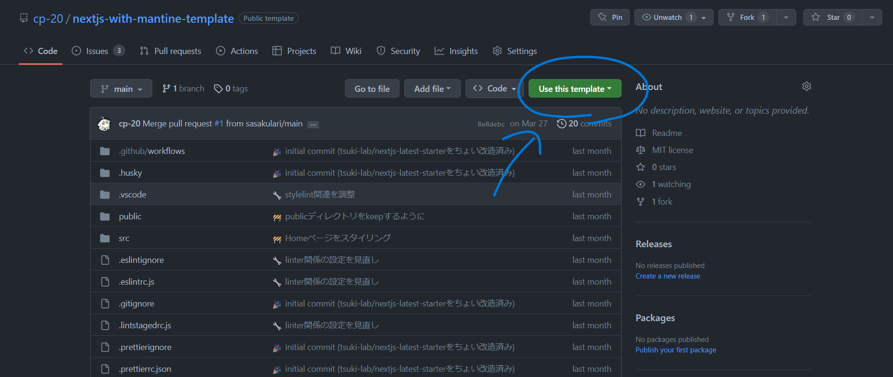

# Next.js with Mantine UI Template

Next.js を Mantine UI と一緒に色々セットアップしてあるオレオレテンプレートリポジトリです。ご利用は計画的に。

## 技術スタック

- [Next.js v13](https://nextjs.org/)
- [Mantine UI v6](https://ui.mantine.dev/)
- [Tabler Icons](https://tabler-icons.io/)
- [Jotai](https://jotai.org/)
- [Emotion](https://emotion.sh/docs/introduction)

- ESlint
- Prettier
- Stylelint

## 使い方

### 1. GitHub で`Use this template`をクリックしてこのテンプレートを使ったリポジトリを作る

### 2. いろんなところの名前とかを調整する

- **`package.json`** → `name`・`version`・`author` (+`license`)
- **`LICENSE`** → 必要であればライセンスそのもの・年と権利者名
- **`src/shared/components/Description.tsx`** → `const appUrl = '';`・`<meta name="twitter:site" content="@__cp20__" />`

### 3. 開発する

良い感じに開発してください

### 4. (リリースする前に) ファビコンとか OG 画像とかを差し替える

別に差し替えなくても大丈夫ですが、差し替えた方が良いと思います。

ファビコンの設定は [「2023 年版、HTML によるファビコン設定方法、さまざまなブラウザやデバイスに対応させる最小限のセットは 6 種類のファイルが必要」](https://coliss.com/articles/build-websites/operation/work/how-to-favicon.html) を参考にして以下の 5 ファイルを差し替えてください

- `public/apple-touch-icon.png`
- `public/favicon.ico`
- `public/icon-192.png`
- `public/icon-512.png`
- `public/icon.svg`

OG 画像は静的なもので良ければ`public/ogp.png`を良い感じに差し替えてください

### 5. いらないものを消す

`readme/readme-github-image.png`とかその他いらないものを消してください
